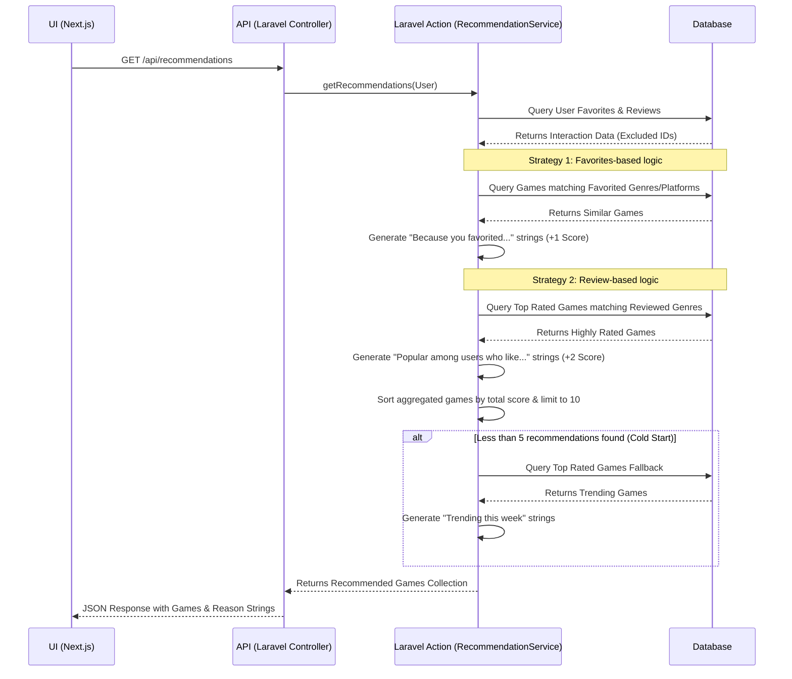

# Recommendation System Implementation

The recommendation system delivers personalized game suggestions through deterministic, rule-based matching—circumventing the need for machine learning techniques. 

At a high level, it analyzes the user's historical interaction data (their favorited titles and high-rated reviews) to establish their preferred genres and platforms. 

### Rule-Based Scoring
The system builds a pool of candidate games and assigns cumulative priority scores based on deterministic matches:
- **+1 Score:** For games sharing the exact genre or platform as titles the user has previously favorited.
- **+2 Score:** For highly rated games that share genres with titles the user reviewed favorably (4+ stars). 
The unified candidate pool is then sorted in descending order by their cumulative score, ensuring the most relevant matches rise to the top.

### Explanation (Reason Strings) Generation
Each candidate game is dynamically tagged with an explainability reason during its scoring phase to prioritize interpretability:
- **Favorites:** *"Because you favorited [Game Title] ([Genre], [Platform])"*
- **Reviews:** *"Popular among users who like [Genre] games"*
- **Cold Start:** If the system is unable to curate at least 5 targeted recommendations, it dynamically pads the list using top-rated fallback titles or JIT external APIs, tagging them with *"Trending this week"*.

## Architectural Flow (Sequence Diagram)
Please refer to the diagram below for the step-by-step lifecycle of a recommendation request.

